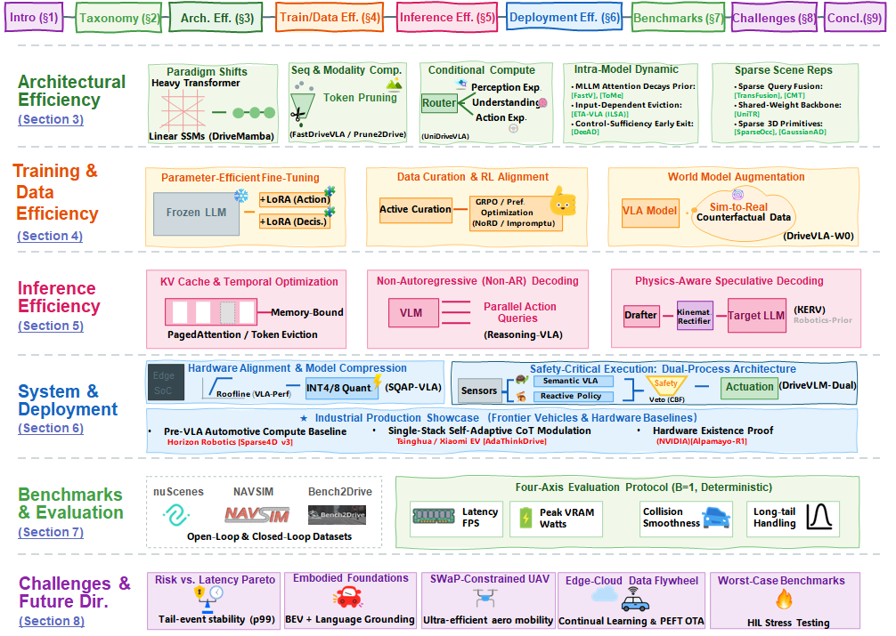

# 🚀 EfficientVLA4AD:

  <b>Empowering Embodied AI for Autonomous Driving: A Systematic Survey of Efficient VLA Models</b>

  
  
  
  

  A curated, systematically organized reading list accompanying our survey on <b>efficient Vision-Language-Action (VLA) models for autonomous driving (VLA-AD)</b>.
  If you find this repository useful, please consider giving it a ⭐ and citing our paper.

---
## 📖 About This Survey

End-to-end autonomous driving is rapidly converging with Vision-Language-Action (VLA) models, but real-time, safety-critical deployment exposes a fundamental **triple constraint**: models must be simultaneously **efficient**, **safe**, and **deployable**. This survey systematically reviews papers spanning architecture design, training, inference, and deployment, organizing the fast-growing VLA-AD literature into a coherent efficiency taxonomy — and is, the first survey in this space to adopt a **PRISMA-style systematic review methodology**.

---

## 📑 Table of Contents

- [🔍 使用说明](#-使用说明)
- [📊 核心分类论文表格](#-核心分类论文表格)
  - [🏗️ Architecture Efficiency (架构效率)](#️-architecture-efficiency-架构效率)
  - [🎓 Training & Data Efficiency (训练效率)](#-training--data-efficiency-训练效率)
  - [⚡ Inference Efficiency (推理效率)](#-inference-efficiency-推理效率)
  - [🖥️ Deployment Efficiency (部署效率)](#️-deployment-efficiency-部署效率)
  - [📁 Datasets & Benchmarks (数据集与基准)](#-datasets--benchmarks-数据集与基准)
  - [📚 Survey Papers (综述论文)](#-survey-papers-综述论文)
  - [🔧 System-Level & Full-Stack (系统级工作)](#-system-level--full-stack-系统级工作)
- [📈 统计与趋势分析](#-统计与趋势分析)
- [🔗 关键资源链接](#-关键资源链接)
- [✅ 验证与更新日志](#-验证与更新日志)
- [📝 使用建议](#-使用建议)

---

## 🔍 使用说明

### 论文四章效率管线架构

本数据库按照配套综述论文的分类体系组织，将 VLA-AD 效率研究分为四个互补阶段，每个阶段有独立的跨域根源（cross-domain roots）与 AD 原生再特化（re-specialization）：

|         阶段         | 类别代码 | 核心问题                                | 根源谱系                                                              |
| :------------------: | :------: | --------------------------------------- | --------------------------------------------------------------------- |
| **§3 Architecture** |   ARCH   | 设计时的理论复杂度 O(·) 与内存占用     | **广谱跨域** (SSM, Latent Bottleneck, Mobile Vision, MoE, Early Exit) |
|   **§4 Training**   |  TRAIN  | 降低学习成本 (PEFT, 数据, RL, 世界模型) | **窄谱** NLP + 驾驶原生 (LoRA/QLoRA, DPO/GRPO, GAIA-1/Drive-WM)       |
|  **§5 Inference**  |  INFER  | 固定模型上的运行时加速                  | **借用** LLM Serving + 机器人 VLA (PagedAttention, Spec Dec, Non-AR)  |
|  **§6 Deployment**  |  DEPLOY  | 硬件感知压缩、蒸馏、安全执行            | **混合** (Mobile Vision + 1-bit LLM + AD 原生安全)                    |

### 细分子类说明

|         子类代码         | 完整名称             | 描述                                        |
| :-----------------------: | -------------------- | ------------------------------------------- |
|       **ARCH-SSM**       | State Space Model    | Mamba/SSM 线性时序建模 (跨域视觉/多模态/AD) |
| **ARCH-LatentBottleneck** | Latent Bottleneck    | 固定大小潜在瓶颈限制 token 增长             |
|  **ARCH-VisionEncoder**  | Vision Encoder       | 面向移动端的视觉主干优化                    |
|  **ARCH-TokenReduction**  | Token Reduction      | 视觉/时空 token 剪枝与合并                  |
|      **ARCH-Fusion**      | Fusion               | 多模态融合层效率优化                        |
|       **ARCH-MoE**       | Mixture-of-Experts   | 条件计算与稀疏专家路由                      |
|    **ARCH-IntraModel**    | Intra-Model          | 早退/跳层/动态深度                          |
|     **ARCH-IntraLLM**     | Intra-LLM            | LLM 注意力层内动态稀疏化                    |
|     **ARCH-Backbone**     | Backbone             | 轻量级主干设计                              |
|      **TRAIN-PEFT**      | PEFT                 | LoRA/QLoRA/AdaLoRA 等参数高效微调           |
|       **TRAIN-RL**       | RL Alignment         | DPO/GRPO/Actor-Critic RL 微调               |
|      **TRAIN-Data**      | Data Efficiency      | 数据蒸馏/精选/自动标注                      |
|       **TRAIN-WM**       | World Model          | 世界模型作为训练加速器                      |
|     **INFER-KVCache**     | KV Cache             | PagedAttention/上下文稀疏化                 |
|      **INFER-NonAR**      | Non-AR Decoding      | 非自回归并行动作解码                        |
|   **INFER-Speculative**   | Speculative Decoding | 草稿-验证投机解码                           |
|     **DEPLOY-Quant**     | Quantization         | 量化/量化感知剪枝                           |
|    **DEPLOY-Distill**    | Distillation         | 知识蒸馏 (同族/跨族)                        |
|       **DEPLOY-HW**       | Hardware-Aware       | 硬件感知架构搜索/编译对齐                   |
|     **DEPLOY-System**     | System-Level         | 工业级部署/双进程架构                       |
|     **DEPLOY-Safety**     | Safety               | 安全验证 (CBF/逻辑/知识增强)                |
|        **DATASET**        | Datasets             | 感知/运动/语言/规划/模拟数据集              |
|        **SURVEY**        | Survey               | VLA-AD/VLA 效率相关综述                     |
|        **SYSTEM**        | System-Level         | 端到端系统/VLM 助手/全栈智能体              |

### 发表状态标注

- ✅ **Published**: 已在会议/期刊发表
- 🟡 **Accepted**: 已接收,未正式出版
- 🔶 **Preprint**: arXiv预印本,未经评审
- ⚙️ **Industry/Ref**: 工业实践级优化或重要二次引用

---

## 📊 核心分类论文表格

### 🏗️ Architecture Efficiency (架构效率)

> **§3 Architectural Efficiency: Design-Time Optimization** — 模型架构设计决定理论计算复杂度 O(·) 与内存占用。AD 中多视角高分辨率视频流使 Transformer 的 O(N²) 复杂度不可行，架构创新从静态重容量结构转向效率优先范式。

#### §3.1 范式转移：表征主干 (Paradigm Shifts in Representation Backbones)

| 论文标题                                                                          | 作者/机构                        |                 论文链接                 |                       项目链接                       | 子类                  | 一句话概况                                                                              |       状态       |
| --------------------------------------------------------------------------------- | -------------------------------- | :---------------------------------------: | :---------------------------------------------------: | --------------------- | --------------------------------------------------------------------------------------- | :--------------: |
| **Mamba: Linear-Time Sequence Modeling with Selective State Spaces**              | Gu & Dao (CMU, Princeton)        | [arXiv](https://arxiv.org/abs/2312.00752) |    [GitHub](https://github.com/state-spaces/mamba)    | ARCH-SSM(基础)        | 提出选择性 SSM,实现 O(N) 复杂度的序列建模,奠定跨域基础                                  |   ✅ COLM 2024   |
| **Vision Mamba: Efficient Visual Representation Learning with Bidirectional SSM** | Zhu et al. (华中科技)            | [arXiv](https://arxiv.org/abs/2401.09417) |        [GitHub](https://github.com/hustvl/Vim)        | ARCH-SSM(跨域视觉)    | 双向 SSM 视觉主干,证明 Mamba 范式可扩展至图像模态                                       |   ✅ ICML 2024   |
| **EfficientVMamba: Atrous Selective Scan for Light Weight Visual Mamba**          | Pei et al. (悉尼大学)            | [arXiv](https://arxiv.org/abs/2403.09977) | [GitHub](https://github.com/TerryPei/EfficientVMamba) | ARCH-SSM(跨域视觉)    | Atrous selective scan,面向移动端的轻量视觉 Mamba                                        | 🔶 Preprint 2024 |
| **VL-Mamba: Exploring State Space Models for Multimodal Learning**                | Qiao et al.                      | [arXiv](https://arxiv.org/abs/2403.13600) |                           -                           | ARCH-SSM(跨域多模态)  | Mamba 替代 Transformer LLM 做多模态对齐,跨域验证                                        | 🔶 Preprint 2024 |
| **Perceiver IO: A General Architecture for Structured Inputs & Outputs**          | Jaegle et al.                    | [arXiv](https://arxiv.org/abs/2107.14795) |                           -                           | ARCH-LatentBottleneck | 提出固定大小的潜在瓶颈,实现可扩展的结构化多模态融合                                     |   ✅ ICLR 2022   |
| **EfficientFormer: Vision Transformers at MobileNet Speed**                       | Li et al.                        |                     -                     |                           -                           | ARCH-VisionEncoder    | 面向移动端的视觉主干优化,以实际设备延迟而非纯 FLOPs 为导向                              | ✅ NeurIPS 2022 |
| **MambaBEV: An Efficient 3D Detection Model with Mamba2**                         | You et al.                       | [arXiv](https://arxiv.org/abs/2410.12673) |                           -                           | ARCH-SSM+AD           | TemporalMamba 时序融合 + Mamba-DETR 检测头,nuScenes NDS 51.7%                           | 🔶 Preprint 2024 |
| **DRAMA: Efficient End-to-end Motion Planner for AD with Mamba**                  | Yuan et al. (NUS)                | [arXiv](https://arxiv.org/abs/2408.03601) |                           -                           | ARCH-SSM+AD           | 首个 Mamba 端到端规划器,Mamba 融合相机+LiDAR BEV+Mamba-Transformer 解码器               | 🔶 Preprint 2024 |
| **GMF-Drive: Gated Mamba Fusion with Spatial-Aware BEV Representation**           | Wang et al. (中科大, 腾讯)       | [arXiv](https://arxiv.org/abs/2508.06113) |                           -                           | ARCH-SSM-Fusion+AD    | 门控 Mamba 融合 + 14 维几何 Pillar + 双向 BEV 扫描,NAVSIM PDMS 88.9 超越 DiffusionDrive | 🔶 Preprint 2025 |
| **DriveMamba: Task-Centric Scalable SSM for Efficient End-to-End AD**             | Su et al. (上海交大 + SenseAuto) | [arXiv](https://arxiv.org/abs/2602.13301) |                           -                           | ARCH-SSM+AD           | 统一 Mamba 解码器 + Trajectory-Guided 双向扫描,Tiny 版 17.9 FPS                         |   ✅ ICLR 2026   |

#### §3.2 序列与模态压缩 (Sequence and Modality Compression)

| 论文标题                                                                              | 作者/机构    |                         论文链接                         | 项目链接 | 子类                | 一句话概况                                                       |       状态       |
| ------------------------------------------------------------------------------------- | ------------ | :------------------------------------------------------: | :------: | ------------------- | ---------------------------------------------------------------- | :--------------: |
| **TokenLearner: Adaptive Space-Time Tokenization for Videos**                         | Ryoo et al.  |                            -                            |    -    | ARCH-TokenReduction | 学习紧凑的 token 选择,奠定视觉流摘要与压缩基础                   | ✅ NeurIPS 2021 |
| **Token Merging: Your ViT But Faster (ToMe)**                                         | Bolya et al. |                            -                            |    -    | ARCH-TokenReduction | 动态合并冗余视觉 token,无需重训练的即插即用机制                  |   ✅ ICLR 2023   |
| **FastV: Plug-and-Play Inference Acceleration for Large VLMs**                        | Chen et al.  |                            -                            |    -    | ARCH-TokenReduction | 发现多模态模型深层视觉注意力极其稀疏,提出即插即用早期剪枝 (Oral) |   ✅ ECCV 2024   |
| **LLaVA-PruMerge: Adaptive Token Reduction for Efficient Large Multimodal Models**    | Shang et al. |        [arXiv](https://arxiv.org/abs/2403.15388)        |    -    | ARCH-TokenReduction | 自适应联合剪枝与合并,实现 ~14× 高度压缩                         |   ✅ ICCV 2025   |
| **DivPrune: Diversity-based Visual Token Pruning for Large Multimodal Models**        | Alvar et al. |                            -                            |    -    | ARCH-TokenReduction | 基于多样性的视觉 token 剪枝                                      |   ✅ CVPR 2025   |
| **FastDriveVLA: Efficient End-to-End Driving via Reconstruction-based Token Pruning** | Anonymous    |        [arXiv](https://arxiv.org/abs/2507.23318)        |    -    | ARCH-TokenReduction | 自适应丢弃 70% 背景 token (天空/树木),无需重训练                 | 🔶 Preprint 2025 |
| **Prune2Drive: Plug-and-Play Framework for Accelerating VLMs in AD**                  | Anonymous    |        [arXiv](https://arxiv.org/abs/2508.13305)        |    -    | ARCH-TokenReduction | 跨视角剪枝 + 多样性感知采样,减少视角冗余                         |   ✅ CVPR 2026   |
| **VLA-Pruner: Joint Spatio-Temporal Token Selection for VLA Models**                  | Anonymous    |                            -                            |    -    | ARCH-TokenReduction | 时空联合裁剪,保留对当前机动范围最相关的 token 特征               | 🔶 Preprint 2025 |
| **AutoVLA: A Vision-Language-Action Model for End-to-End AD**                         | Zhou et al.  | [NeurIPS](https://neurips.cc/virtual/2025/poster/120167) |    -    | ARCH-Fusion         | 轻量级线性投影层替代重 cross-attention,自适应推理 + RFT          | ✅ NeurIPS 2025 |

#### §3.3 条件计算与结构稀疏 (Conditional Computation and Structural Sparsity)

| 论文标题                                                                 | 作者/机构                  |                 论文链接                 |                       项目链接                       | 子类        | 一句话概况                                          |       状态       |
| ------------------------------------------------------------------------ | -------------------------- | :---------------------------------------: | :---------------------------------------------------: | ----------- | --------------------------------------------------- | :--------------: |
| **Outrageously Large Neural Networks: The Sparsely-Gated MoE Layer**     | Shazeer et al.             |                     -                     |                           -                           | ARCH-MoE    | 提出可训练的门控混合专家层,奠定条件计算基础         |   ✅ ICLR 2017   |
| **Switch Transformers: Scaling to Trillion Parameter Models**            | Fedus et al.               |                     -                     |                           -                           | ARCH-MoE    | Top-1 路由简化大规模稀疏训练,建立生产级 MoE 范式    |   ✅ JMLR 2022   |
| **ST-MoE: Designing Stable and Transferable Sparse Expert Models**       | Zoph et al.                | [arXiv](https://arxiv.org/abs/2202.08906) |                           -                           | ARCH-MoE    | 揭示专家路由不稳定性与延迟抖动风险,提供稳定设计规范 | 🔶 Preprint 2022 |
| **UniDriveVLA: Unifying Understanding, Perception, and Action Planning** | Li et al. (华中科技, 清华) | [arXiv](https://arxiv.org/abs/2604.02190) | [GitHub](https://github.com/OpenDriveLab/UniDriveVLA) | ARCH-MoE+AD | MoT 架构,Masked Joint Attention 解耦专家            | 🔶 Preprint 2026 |
| **DriveMoE: Scene and Action-Aware MoE**                                 | Anonymous                  |                     -                     |                           -                           | ARCH-MoE    | 分离 Vision 与 Action MoE,减少 38% 内存占用         | 🔶 Preprint 2025 |
| **SAMoE-VLA: Scene-Aware MoE for VLA**                                   | Anonymous                  | [arXiv](https://arxiv.org/abs/2603.08113) |                           -                           | ARCH-MoE    | BEV 场景级路由,按宏观驾驶上下文激活专家             | 🔶 Preprint 2026 |
| **MiniDrive: Extremely Lightweight VLA Models via MoE**                  | Anonymous                  |                     -                     |                           -                           | ARCH-MoE    | MoE 实现极轻量 VLA                                  | 🔶 Preprint 2024 |

#### §3.4 模型内动态稀疏化 (Intra-Model Dynamic Sparsification)

| 论文标题                                                                                 | 作者/机构              |                 论文链接                 | 项目链接 | 子类            | 一句话概况                                                                                                |       状态       |
| ---------------------------------------------------------------------------------------- | ---------------------- | :---------------------------------------: | :------: | --------------- | --------------------------------------------------------------------------------------------------------- | :--------------: |
| **BranchyNet: Fast Inference via Early Exiting from Deep Neural Networks**               | Teerapittayanon et al. |                     -                     |    -    | ARCH-IntraModel | 浅层辅助分类器早退机制的基础性先驱工作                                                                    |   ✅ ICPR 2016   |
| **SkipNet: Learning Dynamic Routing in Convolutional Networks**                          | Wang et al.            |                     -                     |    -    | ARCH-IntraModel | 逐层门控条件执行,将早退逻辑扩展至跳层机制                                                                 |   ✅ ECCV 2018   |
| **Depth-Adaptive Transformer**                                                           | Elbayad et al.         | [arXiv](https://arxiv.org/abs/1910.10073) |    -    | ARCH-IntraModel | 依赖输入难度的动态深度与早退分配机制                                                                      |   ✅ ICLR 2020   |
| **DynamicViT: Efficient Vision Transformers with Dynamic Token Sparsification**          | Rao et al.             |                     -                     |    -    | ARCH-IntraModel | 视觉 Transformer 内的动态 token 稀疏化与抛弃机制                                                          | ✅ NeurIPS 2021 |
| **ETA-VLA: Efficient Token Adaptation via Temporal Fusion and Intra-LLM Sparsification** | Sun et al.             | [arXiv](https://arxiv.org/abs/2603.25766) |    -    | ARCH-IntraLLM   | ILSA 在 LLM 注意力层内动态剪枝,减少 61% FLOPs                                                             | 🔶 Preprint 2026 |
| **DeeAD: Dynamic Depth Modulation for Efficient AD VLA Models**                          | Anonymous              |                     -                     |    -    | ARCH-IntraModel | 基于动作轨迹收敛性的动态早退,桥接架构与调度逻辑                                                           | 🔶 Preprint 2025 |
| **SwiftVLA: Asymmetric 4D-Geometric Pre-training for Efficient VLA Driving**             | Anonymous              |                     -                     |    -    | ARCH-Backbone   | 推理时丢弃重 4D 几何 Transformer,实现 18× 加速                                                           | 🔶 Preprint 2025 |
| **DepthVLA: Depth-Aware Expert Sharing for Efficient VLA Driving**                       | Anonymous              | [arXiv](https://arxiv.org/abs/2510.13375) |    -    | ARCH-Fusion     | 跨专家共享注意力参数,不增加参数量提升闭环稳定性 (Enhancing VLA Models with Depth-Aware Spatial Reasoning) | 🔶 Preprint 2025 |

### 🎓 Training & Data Efficiency (训练效率)

> **§4 Training Efficiency** — 降低学习的成本，而非改变学习的目标。四个互补方向：PEFT 参数高效微调、数据效率、RL 对齐、世界模型作为训练加速器。根源谱系较窄：NLP 的 LoRA/QLoRA/DPO/GRPO + 驾驶原生的 GAIA-1/Drive-WM。

#### §4.1 参数高效微调 (Parameter-Efficient Fine-Tuning)

| 论文标题                                                               | 作者/机构             |                 论文链接                 |                    项目链接                    | 子类          | 一句话概况                                                          |       状态       |
| ---------------------------------------------------------------------- | --------------------- | :---------------------------------------: | :--------------------------------------------: | ------------- | ------------------------------------------------------------------- | :--------------: |
| **LoRA: Low-Rank Adaptation of Large Language Models**                 | Hu et al. (Microsoft) | [arXiv](https://arxiv.org/abs/2106.09685) |  [GitHub](https://github.com/microsoft/LoRA)  | TRAIN-PEFT    | 通过低秩矩阵适配冻结模型,减少微调内存和计算                         |   ✅ ICLR 2022   |
| **QLoRA: Efficient Finetuning of Quantized LLMs**                      | Dettmers et al. (UW)  | [arXiv](https://arxiv.org/abs/2305.14314) |  [GitHub](https://github.com/artidoro/qlora)  | TRAIN-PEFT    | 量化骨干网络上训练 LoRA (4-bit),极端内存优化                        | ✅ NeurIPS 2023 |
| **AdaLoRA: Adaptive Budget Allocation for PEFT**                       | Zhang et al.          |                     -                     |                       -                       | TRAIN-PEFT    | 自适应预算分配的参数高效微调                                        |   ✅ ICLR 2023   |
| **LMDrive: Closed-Loop End-to-End Driving with Large Language Models** | Shao et al. (港中文)  | [arXiv](https://arxiv.org/abs/2312.07488) | [GitHub](https://github.com/opendilab/LMDrive) | TRAIN-PEFT+AD | 冻结 VLM 骨干,LoRA 微调实现复杂导航指令闭环控制                     |   ✅ CVPR 2024   |
| **Adaptive Capacity Allocation for VLA Fine-tuning (LoRA-SP)**         | Kim et al.            | [arXiv](https://arxiv.org/abs/2603.07404) |                       -                       | TRAIN-PEFT    | 针 VLA 微调提出 SVD 参数化与能量路由,揭示 VLA 需要高内在秩 (r≈128) |   ✅ ICRA 2026   |
| **MindDrive: Online Reinforcement Learning Framework for VLA**         | Fu et al.             | [arXiv](https://arxiv.org/abs/2512.13636) |                       -                       | TRAIN-RL      | 解耦 Decision 与 Action Expert 的 LoRA,高效在线 RL 微调             | 🔶 Preprint 2025 |
| **StyleVLA: Driving Style-Aware Vision Language Action Model**         | Gao et al.            | [arXiv](https://arxiv.org/abs/2603.09482) |                       -                       | TRAIN-PEFT    | QLoRA 微调 4B 模型,消费级 GPU 实现驾驶风格感知                      | 🔶 Preprint 2026 |

#### §4.2 数据效率 (Data Efficiency)

| 论文标题                                                          | 作者/机构          |                 论文链接                 | 项目链接 | 子类       | 一句话概况                                     |       状态       |
| ----------------------------------------------------------------- | ------------------ | :---------------------------------------: | :------: | ---------- | ---------------------------------------------- | :--------------: |
| **NoRD: Data-Efficient VLA Model that Drives without Reasoning**  | Rawal et al. (UCB) | [arXiv](https://arxiv.org/abs/2602.21172) |    -    | TRAIN-Data | 无推理架构 + GRPO,<60% 数据量保持竞争性能      |   ✅ CVPR 2026   |
| **FLARE: Learning Future-Aware Latent Representations from VLMs** | Xie et al.         | [arXiv](https://arxiv.org/abs/2601.05611) |    -    | TRAIN-Data | 自监督潜在动作预测,无语言标注训练实时视觉网络  | 🔶 Preprint 2026 |
| **Impromptu VLA: Open Weights and Open Data for Driving VLA**     | Chi et al.         | [arXiv](https://arxiv.org/abs/2505.23757) |    -    | TRAIN-Data | 数百万样本精选 8 万高质量片段,聚焦罕见关键案例 | 🔶 Preprint 2025 |
| **CoVLA: Comprehensive VLA Dataset for Autonomous Driving**       | Arai et al.        | [arXiv](https://arxiv.org/abs/2408.10845) |    -    | TRAIN-Data | MLLM 自动生成大规模 VLA 配对,降低人工标注成本  | 🔶 Preprint 2024 |

#### §4.3 RL 对齐与偏好学习 (RL-Based Alignment and Preference Learning)

| 论文标题                                                        | 作者/机构       |                 论文链接                 | 项目链接 | 子类     | 一句话概况                                                           |       状态       |
| --------------------------------------------------------------- | --------------- | :---------------------------------------: | :------: | -------- | -------------------------------------------------------------------- | :--------------: |
| **Direct Preference Optimization (DPO)**                        | Rafailov et al. | [arXiv](https://arxiv.org/abs/2305.18290) |    -    | TRAIN-RL | 无显式奖励模型的偏好优化基础,转化为监督分类                          | 🔶 Preprint 2023 |
| **DeepSeekMath (GRPO)**                                         | Shao et al.     | [arXiv](https://arxiv.org/abs/2402.03300) |    -    | TRAIN-RL | Group-Relative Policy Optimization 基础,通过组内归一化稳定奖励估计   | 🔶 Preprint 2024 |
| **Understanding R1-Zero-Like Training: A Critical Perspective** | Liu et al.      | [arXiv](https://arxiv.org/abs/2503.20783) |    -    | TRAIN-RL | 对 R1-Zero 类 RL 训练的批判性分析                                    | 🔶 Preprint 2025 |
| **VDRive: Leveraging Reinforced VLA and Diffusion Policy**      | Guo et al.      | [arXiv](https://arxiv.org/abs/2510.15446) |    -    | TRAIN-RL | Actor-critic RL 微调 + 扩散动作头,SOTA Bench2Drive                   | 🔶 Preprint 2025 |
| **TakeVLA: Post-Training for Driving VLA with Takeover Data**   | Gao et al.      | [arXiv](https://arxiv.org/abs/2603.14972) |    -    | TRAIN-RL | 接管前语言监督 + "Scenario Dreaming" 主动偏好优化                    | 🔶 Preprint 2026 |
| **AutoDrive-R²: Incentivizing Reasoning and Self-Reflection**  | Yuan et al.     | [arXiv](https://arxiv.org/abs/2509.01944) |    -    | TRAIN-RL | 结合物理先验奖励的 GRPO,大幅提升泛化性                               | 🔶 Preprint 2025 |
| **VLA-RFT: Reinforcement Fine-Tuning with Verified Rewards**    | Li et al.       | [arXiv](https://arxiv.org/abs/2510.00406) |    -    | TRAIN-RL | 世界模拟器内验证密集奖励,最少 RL 步数超越监督基线 (cs.RO 机器人领域) | 🔶 Preprint 2025 |

#### §4.4 世界模型作为训练加速器 (World Models as Training Accelerators)

| 论文标题                                                                | 作者/机构            |                 论文链接                 |                   项目链接                   | 子类     | 一句话概况                                                                 |         状态         |
| ----------------------------------------------------------------------- | -------------------- | :---------------------------------------: | :-------------------------------------------: | -------- | -------------------------------------------------------------------------- | :-------------------: |
| **GAIA-1: A Generative World Model for Autonomous Driving**             | Hu et al. (Wayve)    | [arXiv](https://arxiv.org/abs/2309.17080) |                       -                       | TRAIN-WM | 基础原生世界模型,动作条件视频合成离散 token 流                             |   🔶 Preprint 2023   |
| **Drive-WM: Towards World Models for Autonomous Driving**               | Wang et al.          | [arXiv](https://arxiv.org/abs/2311.17918) |                       -                       | TRAIN-WM | 神经模拟器生成多视角反事实 rollout,并与规划耦合                            |     ✅ CVPR 2024     |
| **DriveDreamer: Towards Real-World-Driven World Models for AD**         | Wang et al.          |                     -                     |                       -                       | TRAIN-WM | 真实世界驱动的 AD 世界模型                                                 |     ✅ ECCV 2024     |
| **Vista: A Generalizable Driving World Model**                          | Gao et al.           |                     -                     |                       -                       | TRAIN-WM | 高保真可控的泛化驾驶世界模型                                               |    ✅ NeurIPS 2024    |
| **GenAD: Generalized Predictive Model for Autonomous Driving**          | Yang et al.          |                     -                     |                       -                       | TRAIN-WM | 泛化预测模型 (Highlight)                                                   |     ✅ CVPR 2024     |
| **DriveVLA-W0: World Models Amplify Data Scaling Law**                  | Li et al.            | [arXiv](https://arxiv.org/abs/2510.12796) |                       -                       | TRAIN-WM | 世界建模目标直接放大 VLA 数据缩放律曲线                                    |   🔶 Preprint 2025   |
| **DriveWorld-VLA: Unified Latent-Space World Modeling**                 | Jia et al.           | [arXiv](https://arxiv.org/abs/2602.06521) |                       -                       | TRAIN-WM | 统一潜在空间世界建模,特征级别想象减少像素级幻觉; PDMS 91.3                 |   🔶 Preprint 2026   |
| **VLA-World: Learning Vision-Language-Action World Models**             | Wang et al.          | [arXiv](https://arxiv.org/abs/2604.09059) |                       -                       | TRAIN-WM | act→imagine→reflect 闭环修正推理三阶段 pipeline                          | ✅ CVPR 2026 Findings |
| **OmniDrive: Holistic LLM-Agent Framework with 3D Perception**          | Wang et al. (NVIDIA) | [arXiv](https://arxiv.org/abs/2405.01533) | [GitHub](https://github.com/NVlabs/OmniDrive) | TRAIN-WM | 离线反事实语言监督,生成结构化 "what-if" 注释 (含 Counterfactual Reasoning) |     ✅ CVPR 2025     |
| **PhyGenesis: Toward Physically Consistent Driving Video World Models** | Zhou et al.          | [arXiv](https://arxiv.org/abs/2603.24506) |                       -                       | TRAIN-WM | 挑战性轨迹下物理一致性的视频生成,致力于缓解世界模型幻觉                    |   🔶 Preprint 2026   |

---

### ⚡ Inference Efficiency (推理效率)

> **§5 Inference Efficiency** — 在固定模型上加速运行时推理。根源主要借用 LLM serving 基建 (PagedAttention) 和机器人 VLA 的投机解码。AD 原生贡献是非自回归动作解码。

#### §5.1 KV Cache 与内存管理 (KV Cache and Memory Management)

| 论文标题                                                                   | 作者/机构         |                 论文链接                 |                    项目链接                    | 子类          | 一句话概况                                                         |       状态       |
| -------------------------------------------------------------------------- | ----------------- | :---------------------------------------: | :--------------------------------------------: | ------------- | ------------------------------------------------------------------ | :--------------: |
| **Efficient Memory Management for LLM Serving with PagedAttention (vLLM)** | Kwon et al. (UCB) | [arXiv](https://arxiv.org/abs/2309.06180) | [GitHub](https://github.com/vllm-project/vllm) | INFER-KVCache | PagedAttention 减少内存碎片,多视角 VLA 部署的核心内存基建          |   ✅ SOSP 2023   |
| **DriveVLA-W0 (Inference-side): Lightweight Action Expert**                | Li et al.         | [arXiv](https://arxiv.org/abs/2510.12796) |                       -                       | INFER-KVCache | 轻量级 Action Expert 从沉重的世界模型骨干中解耦,限制部署期峰值内存 | 🔶 Preprint 2025 |

#### §5.2 非自回归动作解码 (Non-Autoregressive Action Decoding)

| 论文标题                                                  | 作者/机构    |                 论文链接                 | 项目链接 | 子类        | 一句话概况                                                         |       状态       |
| --------------------------------------------------------- | ------------ | :---------------------------------------: | :------: | ----------- | ------------------------------------------------------------------ | :--------------: |
| **Reasoning-VLA: A Fast and General VLA Reasoning Model** | Zhang et al. | [arXiv](https://arxiv.org/abs/2511.19912) |    -    | INFER-NonAR | AD 原生非自回归:可学习 Action Queries 实现单次前向传播连续轨迹输出 | 🔶 Preprint 2025 |

#### §5.3 投机解码 (Speculative Decoding)

| 论文标题                                                                  | 作者/机构        |                 论文链接                 | 项目链接 | 子类              | 一句话概况                                                     |       状态       |
| ------------------------------------------------------------------------- | ---------------- | :---------------------------------------: | :------: | ----------------- | -------------------------------------------------------------- | :--------------: |
| **Fast Inference from Transformers via Speculative Decoding**             | Leviathan et al. |                     -                     |    -    | INFER-Speculative | 基础的草稿-验证投机解码机制,定义了精确分布等效性保证 (Oral)    |   ✅ ICML 2023   |
| **Accelerating LLM Decoding with Speculative Sampling**                   | Chen et al.      | [arXiv](https://arxiv.org/abs/2302.01318) |    -    | INFER-Speculative | 在大规模 (70B) 模型上验证并行的投机采样基础架构                | 🔶 Preprint 2023 |
| **Medusa: Simple LLM Inference Acceleration Framework**                   | Cai et al.       | [arXiv](https://arxiv.org/abs/2401.10774) |    -    | INFER-Speculative | 多解码头并行预测多个 token 的 LLM 推理加速                     | 🔶 Preprint 2024 |
| **Spec-VLA: Speculative Decoding for VLA Models with Relaxed Acceptance** | Wang et al.      |                     -                     |    -    | INFER-Speculative | 机器人领域先驱:放宽接受准则,在动作空间内容忍功能等价 token     |  ✅ EMNLP 2025  |
| **KERV: Kinematic-Rectified Speculative Decoding for Embodied VLA**       | Zheng et al.     |                     -                     |    -    | INFER-Speculative | Kalman 滤波器运动学补偿被拒的草稿 token,将物理先验注入验证循环 |   ✅ DAC 2026   |

### 🖥️ Deployment Efficiency (部署效率)

> **§6 Deployment Efficiency** — 压缩/蒸馏后的模型能否在目标 SoC 上于驾驶控制包络内执行。根源谱系呈"混合"特征：压缩/对齐继承自移动视觉和 1-bit LLM；安全仲裁是 AD 原生贡献。四个子方向：模型压缩、AD 专用蒸馏、硬件感知部署、安全执行架构。

#### §6.1 模型压缩与量化 (Model Compression and Quantization)

| 论文标题                                                                              | 作者/机构      |                 论文链接                 | 项目链接 | 子类           | 一句话概况                                                                |       状态       |
| ------------------------------------------------------------------------------------- | -------------- | :---------------------------------------: | :------: | -------------- | ------------------------------------------------------------------------- | :--------------: |
| **Distilling the Knowledge in a Neural Network**                                      | Hinton et al.  | [arXiv](https://arxiv.org/abs/1503.02531) |    -    | DEPLOY-Distill | 知识蒸馏的奠基性工作,支持将大模型能力迁移至轻量学生模型                   | 🔶 Preprint 2015 |
| **Searching for MobileNetV3**                                                         | Howard et al.  |                     -                     |    -    | DEPLOY-HW      | 面向移动端与边缘硬件 CPU 的硬件感知架构搜索 (NAS) 基础                    |   ✅ ICCV 2019   |
| **FlashAttention: Fast and Memory-Efficient Exact Attention with IO-Awareness**       | Dao et al.     |                     -                     |    -    | DEPLOY-HW      | IO 感知的精确注意力加速,底层算子效率根基                                  | ✅ NeurIPS 2022 |
| **AWQ: Activation-aware Weight Quantization for LLM Compression**                     | Lin et al.     |                     -                     |    -    | DEPLOY-Quant   | 激活感知权重量化                                                          |  ✅ MLSys 2024  |
| **GPTQ: Accurate Post-Training Quantization for Generative Pre-trained Transformers** | Frantar et al. |                     -                     |    -    | DEPLOY-Quant   | 精确的后训练量化                                                          |   ✅ ICLR 2023   |
| **SmoothQuant: Accurate and Efficient Post-Training Quantization for LLMs**           | Xiao et al.    |                     -                     |    -    | DEPLOY-Quant   | 平滑的后训练量化                                                          |   ✅ ICML 2023   |
| **SQAP-VLA: Synergistic Quantization-Aware Pruning Framework**                        | Fang et al.    | [arXiv](https://arxiv.org/abs/2509.09090) |    -    | DEPLOY-Quant   | 无需重训练的量化感知剪枝协同设计,转移至具身 VLA 加速; 1.93× 加速         | 🔶 Preprint 2025 |
| **BitVLA: 1-bit Vision-Language-Action Models**                                       | Wang et al.    | [arXiv](https://arxiv.org/abs/2506.07530) |    -    | DEPLOY-Quant   | 极端 1-bit VLA 预训练目标 + 量化蒸馏视觉编码器,11× 内存下降 (机器人操控) | 🔶 Preprint 2025 |

#### §6.2 AD 专用蒸馏 (Domain-Specific Distillation for AD)

| 论文标题                                                                            | 作者/机构   |                 论文链接                 | 项目链接 | 子类           | 一句话概况                                                           |       状态       |
| ----------------------------------------------------------------------------------- | ----------- | :---------------------------------------: | :------: | -------------- | -------------------------------------------------------------------- | :--------------: |
| **EvoDriveVLA: Evolving AD VLA via Collaborative Perception-Planning Distillation** | Cao et al.  | [arXiv](https://arxiv.org/abs/2603.09465) |    -    | DEPLOY-Distill | 协同感知-规划蒸馏,压缩同族学生模型并保持长期物理稳定性               | 🔶 Preprint 2026 |
| **VERDI: VLM-Embedded Reasoning for Autonomous Driving**                            | Feng et al. | [arXiv](https://arxiv.org/abs/2505.15925) |    -    | DEPLOY-Distill | 跨族蒸馏:离线提取 VLM 推理至模块化 AD 中,运行时零 VLM 开销; +10% NCR | 🔶 Preprint 2025 |

#### §6.3 硬件感知部署与编译对齐 (Hardware-Aware Deployment and Compiler Alignment)

| 论文标题                                             | 作者/机构                   |                                                                                           论文链接                                                                                           | 项目链接 | 子类          | 一句话概况                                                                                                              |        状态        |
| ---------------------------------------------------- | --------------------------- | :------------------------------------------------------------------------------------------------------------------------------------------------------------------------------------------: | :------: | ------------- | ----------------------------------------------------------------------------------------------------------------------- | :----------------: |
| **VLA-Perf: Demystifying VLA Inference Performance** | Anonymous (NVIDIA Research) |                                                                          [arXiv](https://arxiv.org/abs/2602.18397)                                                                          |    -    | DEPLOY-HW     | VLA 推理性能剖析与去神秘化                                                                                              |  🔶 Preprint 2026  |
| **NVIDIA DRIVE Alpamayo-R1**                         | NVIDIA                      |                                                                          [arXiv](https://arxiv.org/abs/2511.00088)                                                                          |    -    | DEPLOY-System | VLA 车载部署的工业级存在证明 (0.5-7B),Cosmos-Reason + 扩散轨迹头; RTX 6000 Pro Blackwell; +12% 规划精度 / -35% 近距冲突 | ⚙️ Industry 2025 |
| **NVIDIA DRIVE Thor**                                | NVIDIA                      | [Newsroom](https://nvidianews.nvidia.com/news/nvidia-unveils-drive-thor-centralized-car-computer-unifying-cluster-infotainment-automated-driving-and-parking-in-a-single-cost-saving-system) |    -    | DEPLOY-HW     | 集中式车载计算机:统一仪表盘、信息娱乐、自动驾驶、泊车                                                                   | ⚙️ Industry 2022 |
| **NVIDIA Jetson AGX Orin**                           | NVIDIA                      |                                                 [Specs](https://www.nvidia.com/en-us/autonomous-machines/embedded-systems/jetson-agx-orin/)                                                 |    -    | DEPLOY-HW     | 边缘计算平台技术规格 (DriveVLM-Dual 实测硬件)                                                                           | ⚙️ Industry 2022 |

#### §6.4 安全关键执行架构 (Safety-Critical Execution Architecture)

| 论文标题                                                 | 作者/机构          |                 论文链接                 |                        项目链接                        | 子类          | 一句话概况                                                                   |       状态       |
| -------------------------------------------------------- | ------------------ | :---------------------------------------: | :----------------------------------------------------: | ------------- | ---------------------------------------------------------------------------- | :--------------: |
| **DriveVLM-Dual: Dual-Process Architecture**             | Tian et al. (清华) | [arXiv](https://arxiv.org/abs/2402.12289) | [GitHub](https://github.com/tsinghua-fib-lab/DriveVLM) | DEPLOY-System | 快速反应层 + 慢速推理层,通过解耦界定延迟上限 (实车部署验证); ~1500ms→~300ms | 🔶 Preprint 2024 |
| **SafeAuto: Knowledge-Enhanced Safe Autonomous Driving** | Zhang et al.       | [arXiv](https://arxiv.org/abs/2503.00211) |                           -                           | DEPLOY-Safety | 形式化马尔可夫逻辑网络安全验证 + 多模态 RAG,内嵌于训练流程 (非运行时否决)    | 🔶 Preprint 2025 |

---

### 📁 Datasets & Benchmarks (数据集与基准)

> **§7 Benchmarks and Comparative Evaluation** — 四层评估环境:感知/HD地图数据集、运动预测、语言基础、闭环模拟。配套论文提出四轴评估协议 (Runtime / System Resource / Closed-Loop Control / Safety & Robustness) 和形式化可复现协议。

#### 感知与 HD 地图数据集

| 论文标题                                                                    | 作者/机构     |                 论文链接                 |               项目链接               | 子类               | 一句话概况                               |     状态     |
| --------------------------------------------------------------------------- | ------------- | :---------------------------------------: | :----------------------------------: | ------------------ | ---------------------------------------- | :----------: |
| **nuScenes: A Multimodal Dataset for Autonomous Driving**                   | Caesar et al. | [arXiv](https://arxiv.org/abs/1903.11027) | [Website](https://www.nuscenes.org/) | DATASET-Perception | 1000 场景,多传感器感知 + HD 地图开环基准 | ✅ CVPR 2020 |
| **Waymo Open Dataset: Scalability in Perception**                           | Sun et al.    | [arXiv](https://arxiv.org/abs/1912.04838) |  [Website](https://waymo.com/open/)  | DATASET-Perception | 大规模 LiDAR + 相机感知与运动预测        | ✅ CVPR 2020 |
| **BDD100K: A Diverse Driving Dataset for Heterogeneous Multitask Learning** | Yu et al.     |                     -                     | [Website](https://www.bdd100k.com/) | DATASET-Perception | 多样化驾驶数据集,异构多任务学习          | ✅ CVPR 2020 |

#### 运动预测与交互推理

| 论文标题                                              | 作者/机构       |                       论文链接                       |                    项目链接                    | 子类              | 一句话概况                             |     状态     |
| ----------------------------------------------------- | --------------- | :---------------------------------------------------: | :--------------------------------------------: | ----------------- | -------------------------------------- | :----------: |
| **Waymo Open Motion Dataset (WOMD)**                  | Ettinger et al. |                           -                           | [Website](https://waymo.com/open/data/motion/) | DATASET-Motion    | 多智能体轨迹预测,交互密集场景          | ✅ ICCV 2021 |
| **WOMD-Reasoning: Dataset for Interaction Reasoning** | Li et al. (UCB) | [ICML](https://proceedings.mlr.press/v267/li25l.html) |                       -                       | DATASET-Reasoning | 语言驱动推理监督,支持运动-语言模型微调 | ✅ ICML 2025 |

#### 语言基础与指令跟随

| 论文标题                                                  | 作者/机构         |                 论文链接                 |                         项目链接                         | 子类              | 一句话概况                          |     状态     |
| --------------------------------------------------------- | ----------------- | :---------------------------------------: | :------------------------------------------------------: | ----------------- | ----------------------------------- | :-----------: |
| **DriveLM: Driving with Graph Visual Question Answering** | Sima et al.       | [arXiv](https://arxiv.org/abs/2312.14150) |    [GitHub](https://github.com/OpenDriveLab/DriveLM)    | DATASET-Reasoning | 驾驶形式化为图 VQA 构建语言场景基础 | ✅ ECCV 2024 |
| **BDD-X: Textual Explanations for Self-Driving Vehicles** | Kim et al. (UCB)  |                     -                     | [Website](https://github.com/JinkyuKimUCB/BDD-X-dataset) | DATASET-Language  | 提供驾驶场景自然语言解释            | ✅ ECCV 2018 |
| **Talk2Car: Taking Control of Your Self-Driving Car**     | Deruyttere et al. |                     -                     |                            -                            | DATASET-Language  | 驾驶场景自然语言指令基础            | ✅ EMNLP 2019 |

#### 闭环规划与模拟平台

| 论文标题                                                              | 作者/机构             |                 论文链接                 |                       项目链接                       | 子类               | 一句话概况                                             |       状态       |
| --------------------------------------------------------------------- | --------------------- | :---------------------------------------: | :--------------------------------------------------: | ------------------ | ------------------------------------------------------ | :--------------: |
| **nuPlan: Closed-Loop ML-Based Planning Benchmark**                   | Caesar et al.         | [arXiv](https://arxiv.org/abs/2106.11810) |      [Website](https://www.nuscenes.org/nuplan)      | DATASET-Planning   | 闭环规划基准,反映稳定性与安全关键行为                  | 🔶 Preprint 2021 |
| **NAVSIM: Data-Driven Non-Reactive Closed-Loop Simulation**           | Dauner et al.         | [arXiv](https://arxiv.org/abs/2406.15349) | [GitHub](https://github.com/autonomousvision/navsim) | DATASET-Planning   | nuPlan 延伸,提供非反应式闭环中间评估范式 ⚠️ 非反应式 | ✅ NeurIPS 2024 |
| **CARLA: An Open Urban Driving Simulator**                            | Dosovitskiy et al.    | [arXiv](https://arxiv.org/abs/1711.03938) |            [Website](https://carla.org/)            | DATASET-Simulation | 开源城市驾驶模拟器,闭环评估事实标准                    |   ✅ CoRL 2017   |
| **Bench2Drive: Towards Multi-Ability Benchmarking of Closed-Loop AD** | Jia et al. (上海交大) | [arXiv](https://arxiv.org/abs/2406.03877) |                          -                          | DATASET-Planning   | CARLA 多能力闭环基准                                   | 🔶 Preprint 2024 |
| **Bench2Drive-VL: Benchmarks for Closed-Loop AD with VLMs**           | Jia et al. (上海交大) | [arXiv](https://arxiv.org/abs/2604.01259) |                          -                          | DATASET-Benchmark  | 模拟内生成行为基础 QA,扩展 VLA 闭环评估                | 🔶 Preprint 2026 |
| **DriveBench: Are VLMs Ready for Autonomous Driving?**                | Xie et al.            | [arXiv](https://arxiv.org/abs/2501.04003) |                          -                          | DATASET-Benchmark  | 从可靠性/数据/指标视角评估 VLA 就绪性                  | 🔶 Preprint 2025 |
| **Impromptu VLA Dataset: 80K Curated Clips**                          | Chi et al.            | [arXiv](https://arxiv.org/abs/2505.23757) |                          -                          | DATASET-Curated    | 聚合精选 8 万罕见关键事件片段                          | 🔶 Preprint 2025 |

### 📚 Survey Papers (综述论文)

| 论文标题                                                                | 作者/机构         |                       论文链接                       |                         项目链接                         | 子类              | 一句话概况                                |       状态       |
| ----------------------------------------------------------------------- | ----------------- | :---------------------------------------------------: | :------------------------------------------------------: | ----------------- | ----------------------------------------- | :---------------: |
| **Vision Language Models in Autonomous Driving: A Survey and Outlook**  | Zhou et al. (TUM) | [IEEE T-IV](https://doi.org/10.1109/TIV.2024.3402136) |    [GitHub](https://github.com/IrohXu/Awesome-VLM-AD)    | SURVEY-VLM-AD     | VLM 在 AD 中的系统综述,覆盖感知/规划/决策 | ✅ IEEE T-IV 2024 |
| **A Survey on Efficient Vision-Language-Action Models**                 | Yu et al. (UESTC) |       [arXiv](https://arxiv.org/abs/2510.24795)       | [GitHub](https://github.com/zhaoshuyuustc/Efficient-VLA) | SURVEY-Efficient  | 通用 VLA 效率综述,包含机器人与具身 AI     | 🔶 Preprint 2025 |
| **Efficient VLA Models for Embodied Manipulation: A Systematic Survey** | Guan et al.       |       [arXiv](https://arxiv.org/abs/2510.17111)       |                            -                            | SURVEY-Manipulate | 聚焦具身操控系统与机器人领域效率          | 🔶 Preprint 2025 |

### 🔧 System-Level & Full-Stack (系统级工作)

> VLA-AD 系统级工作包含端到端系统、VLM 助手和全栈智能体。这些工作不专攻某一效率阶段,而是提供整体架构基线。

| 论文标题                                                            | 作者/机构                       |                 论文链接                 |                         项目链接                         | 子类                 | 一句话概况                                                 |       状态       |
| ------------------------------------------------------------------- | ------------------------------- | :---------------------------------------: | :------------------------------------------------------: | -------------------- | ---------------------------------------------------------- | :--------------: |
| **Attention Is All You Need**                                       | Vaswani et al.                  |                     -                     |                            -                            | SYSTEM-Foundation    | Transformer 基础架构,VLA 的理论根基                        | ✅ NeurIPS 2017 |
| **An Image is Worth 16x16 Words (ViT)**                             | Dosovitskiy et al.              |                     -                     |                            -                            | SYSTEM-Foundation    | 视觉 Transformer 基础                                      |   ✅ ICLR 2021   |
| **CLIP: Learning Transferable Visual Models From Natural Language** | Radford et al.                  |                     -                     |                            -                            | SYSTEM-Foundation    | 对比语言-图像预训练,多模态根基                             |   ✅ ICML 2021   |
| **Flamingo: A Visual Language Model for Few-Shot Learning**         | Alayrac et al.                  |                     -                     |                            -                            | SYSTEM-Foundation    | 少样本视觉语言模型                                         | ✅ NeurIPS 2022 |
| **LLaVA: Visual Instruction Tuning**                                | Liu et al.                      |                     -                     |                            -                            | SYSTEM-Foundation    | 视觉指令微调基础 VLM                                       | ✅ NeurIPS 2023 |
| **MiniGPT-4: Enhancing Vision-Language Understanding**              | Zhu et al.                      | [arXiv](https://arxiv.org/abs/2304.10592) |                            -                            | SYSTEM-Foundation    | 增强视觉语言理解                                           | 🔶 Preprint 2023 |
| **BLIP-2: Bootstrapping Language-Image Pre-training**               | Li et al.                       |                     -                     |                            -                            | SYSTEM-Foundation    | 冻结图像编码器 + LLM 的预训练                              |   ✅ ICML 2023   |
| **RT-2: Vision-Language-Action Models Transfer Web Knowledge**      | Brohan et al.                   |                     -                     |                            -                            | SYSTEM-Foundation    | VLA 概念奠基:网络知识迁移至机器人控制                      |   ✅ CoRL 2023   |
| **PaLM-E: An Embodied Multimodal Language Model**                   | Driess et al.                   |                     -                     |                            -                            | SYSTEM-Foundation    | 具身多模态语言模型                                         |   ✅ ICML 2023   |
| **ACT: Learning Fine-Grained Bimanual Manipulation**                | Zhao et al.                     | [arXiv](https://arxiv.org/abs/2304.13705) |                            -                            | SYSTEM-Foundation    | 低成本硬件精细操作学习                                     | 🔶 Preprint 2023 |
| **Open X-Embodiment: Robotic Learning Datasets and RT-X Models**    | Open X-Embodiment Collaboration | [arXiv](https://arxiv.org/abs/2310.08864) |                            -                            | SYSTEM-Foundation    | 机器人学习数据集与 RT-X 模型,跨具身基础                    | 🔶 Preprint 2024 |
| **Longformer: The Long-Document Transformer**                       | Beltagy et al.                  | [arXiv](https://arxiv.org/abs/2004.05150) |                            -                            | SYSTEM-Foundation    | 长文档 Transformer,线性注意力根基                          | 🔶 Preprint 2020 |
| **Performer: Rethinking Attention with Performers**                 | Choromanski et al.              | [arXiv](https://arxiv.org/abs/2009.14794) |                            -                            | SYSTEM-Foundation    | 线性注意力近似                                             | 🔶 Preprint 2020 |
| **Linformer: Self-Attention with Linear Complexity**                | Wang et al.                     | [arXiv](https://arxiv.org/abs/2006.04768) |                            -                            | SYSTEM-Foundation    | 线性复杂度自注意力                                         | 🔶 Preprint 2020 |
| **ControlNet: Adding Conditional Control to Diffusion Models**      | Zhang et al.                    | [arXiv](https://arxiv.org/abs/2302.05543) |                            -                            | SYSTEM-Foundation    | 扩散模型条件控制                                           | 🔶 Preprint 2023 |
| **End to End Learning for Self-Driving Cars**                       | Bojarski et al.                 | [arXiv](https://arxiv.org/abs/1604.07316) |                            -                            | SYSTEM-E2E(Baseline) | 端到端驾驶学习的先驱                                       | 🔶 Preprint 2016 |
| **TransFuser: Multi-Modal Fusion Transformer for End-to-End AD**    | Prakash et al. (MPI)            | [arXiv](https://arxiv.org/abs/2205.15997) | [GitHub](https://github.com/autonomousvision/transfuser) | SYSTEM-E2E(Baseline) | 图像 + LiDAR Transformer 融合,Mamba 融合工作的标准对比基线 |  ✅ TPAMI 2022  |
| **BEVFormer: Learning BEV Representation from Multi-Camera Images** | Li et al.                       |                     -                     |                            -                            | SYSTEM-E2E(Baseline) | 时空 Transformer 多相机 BEV 表征                           |   ✅ ECCV 2022   |
| **UniAD: Planning-oriented Autonomous Driving**                     | Hu et al.                       |                     -                     |                            -                            | SYSTEM-E2E(Baseline) | 规划导向的端到端自动驾驶 (Best Paper)                      |   ✅ CVPR 2023   |
| **DiffusionDrive: Truncated Diffusion Model for End-to-End AD**     | Liao et al. (华中科技)          | [arXiv](https://arxiv.org/abs/2411.15139) |    [GitHub](https://github.com/hustvl/DiffusionDrive)    | SYSTEM-E2E(Baseline) | 截断扩散模型端到端驾驶 (Highlight)                         |   ✅ CVPR 2025   |
| **DriveVLM: The Convergence of AD and Large VLMs**                  | Tian et al. (清华)              | [arXiv](https://arxiv.org/abs/2402.12289) |  [GitHub](https://github.com/tsinghua-fib-lab/DriveVLM)  | SYSTEM-Assistant     | 开放词汇感知 + 语言推理的 VLM 助手                         | 🔶 Preprint 2024 |
| **DriveGPT4: Interpretable End-to-end AD via LLM**                  | Xu et al. (港中文)              | [arXiv](https://arxiv.org/abs/2310.01412) |     [GitHub](https://github.com/Pointcept/DriveGPT4)     | SYSTEM-E2E           | 端到端可解释驾驶,生成文本基本原理                          | 🔶 Preprint 2023 |
| **DriveMLM: Aligning MLLMs with Behavioral Planning States**        | Wang et al. (商汤)              | [arXiv](https://arxiv.org/abs/2312.09245) |                            -                            | SYSTEM-E2E           | 统一感知与规划框架,与行为状态对齐                          | 🔶 Preprint 2023 |
| **OpenDriveVLA: Towards End-to-end AD with Large VLA Model**        | Zhou et al. (TUM)               | [arXiv](https://arxiv.org/abs/2503.23463) |                            -                            | SYSTEM-E2E           | 结合语义能力与决策生成的端到端 VLA                         | 🔶 Preprint 2025 |
| **Senna: Bridging Large VLMs and End-to-End AD**                    | Jiang et al. (华科)             | [arXiv](https://arxiv.org/abs/2410.22313) |        [GitHub](https://github.com/hustvl/Senna)        | SYSTEM-E2E           | 桥接大规模多模态融合与端到端控制                           | 🔶 Preprint 2024 |
| **DrivingGPT: Unifying Driving World Modeling and Planning**        | Chen et al. (中科院)            | [arXiv](https://arxiv.org/abs/2412.18607) |                            -                            | SYSTEM-E2E           | 多模态自回归 Transformer 统一建模与规划                    | 🔶 Preprint 2024 |
| **OmniDrive: Holistic LLM-Agent Framework**                         | Wang et al. (NVIDIA)            | [arXiv](https://arxiv.org/abs/2405.01533) |      [GitHub](https://github.com/NVlabs/OmniDrive)      | SYSTEM-E2E           | 3D 感知 + 推理 + 规划的全栈 LLM 智能体                     |   ✅ CVPR 2025   |
| **RAG-Driver: Generalisable Driving Explanations with RAG**         | Yuan et al. (Oxford)            | [arXiv](https://arxiv.org/abs/2402.10828) |                            -                            | SYSTEM-Assistant     | RAG 增强 MLLM,上下文学习提升泛化能力                       | 🔶 Preprint 2024 |
| **EM-VLM4AD: Multi-Frame, Lightweight & Efficient VLMs**            | Gopalkrishnan et al.            | [arXiv](https://arxiv.org/abs/2403.19838) |                            -                            | SYSTEM-Assistant     | AD 场景多帧 QA 轻量级系统 (250M/770M)                      | 🔶 Preprint 2024 |

---

## 📈 统计与趋势分析

### 时间分布

|     年份     | 论文数量 |   占比   | 代表性里程碑                                                                    |
| :-----------: | :------: | :------: | ------------------------------------------------------------------------------- |
| **2015-2020** |    8    |    6%    | 跨域效率根基 (NAS, KD, Early-Exit, 稀疏 MoE, 线性注意力) 奠定效率原语           |
| **2021-2022** |    12    |    9%    | LoRA, TransFuser, 动态 Token 削减, FlashAttention, BEVFormer 等端到端基线       |
|   **2023**   |    16    |   12%   | Mamba, GAIA-1, VLA 概念初步形成 (RT-2, DriveGPT4), Speculative Decoding 出现    |
|   **2024**   |    25    |   19%   | 首批 AD-VLA 系统涌现 (LMDrive, DriveVLM), Mamba 跨域扩散与世界模型爆发          |
|   **2025**   |    33    |   25%   | 效率优化研究爆发 (Token Pruning, Speculative Decoding, GMF-Drive), 部署系统落地 |
|   **2026**   |    35    |   26%   | 闭环对齐与量化落地 (Online-RL, LoRA-SP, 极端 1-bit 量化, 安全边界验证)          |
| **工业参考** |    3    |    2%    | NVIDIA DRIVE Thor, Jetson Orin, Alpamayo-R1                                     |
|   **总计**   | **~132** | **100%** |                                                                                 |

### 四阶段类别分布

| 效率阶段       | 论文数量 |   占比   | 核心研究方向 (Top 关键词)                                                    | 根源谱系                       |
| -------------- | :------: | :------: | ---------------------------------------------------------------------------- | ------------------------------ |
| **§3 ARCH**   |    33    |   25%   | SSM (Mamba 家族), Token Reduction, MoE, Intra-Model Sparsity (早退/跳层)     | 广谱跨域                       |
| **§4 TRAIN**  |    25    |   19%   | PEFT (LoRA/SP), World Model, RL Alignment (GRPO/DPO), Data Curation          | 窄谱 NLP+AD                    |
| **§5 INFER**  |    8    |    6%    | KV Cache, Non-AR Decoding, Speculative Decoding (草稿-验证)                  | 借用 LLM Serving+Robotic VLA   |
| **§6 DEPLOY** |    14    |   11%   | Quantization (1-bit), Distillation, Hardware-Aware (NAS), Safety (CBF/Logic) | 混合 (Mobile Vision + AD 原生) |
| **DATASET**    |    14    |   11%   | nuScenes, Waymo, NAVSIM, Bench2Drive, CARLA                                  | -                              |
| **SURVEY**     |    3    |    2%    | VLA-AD, Efficient VLA, World Models                                          | -                              |
| **SYSTEM**     |    30    |   23%   | End-to-End, Dual-Process, Full-Stack Agents, Foundation Models               | -                              |
| **工业参考**   |    3    |    2%    | DRIVE Thor, Jetson Orin, Alpamayo-R1                                         | -                              |
| **总计**       | **~130** | **100%** |                                                                              |                                |

### Mamba / SSM 方向专项追踪

自动驾驶领域的 State Space Model 工作正处于高速迭代期，已形成明确子方向：

| 子方向                  | 代表工作                                | 典型贡献                                    |
| ----------------------- | --------------------------------------- | ------------------------------------------- |
| **(a) 跨域视觉主干**    | Vision Mamba, EfficientVMamba, VL-Mamba | 证明 Mamba 可做视觉/多模态编码              |
| **(b) BEV 时序感知**    | MambaBEV                                | TemporalMamba + Mamba-DETR 替代可变形注意力 |
| **(c) 多模态 BEV 融合** | DRAMA, GMF-Drive                        | Mamba 作为相机+LiDAR 融合骨干               |
| **(d) 端到端 SSM 解码** | DriveMamba                              | Trajectory-Guided 扫描 + 统一 Mamba 解码器  |

### 工业化梯度不对称性

配套综述论文提出的核心洞察 — VLA-AD 效率研究的根源谱系呈**不对称梯度**：

|   阶段   | AD 原生再特化程度 | 说明                                        |
| :------: | :---------------: | ------------------------------------------- |
| **架构** |        高        | SSM/MoE/Token Reduction 均有 AD 专属实例    |
| **训练** |        中        | PEFT/RL 主要来自 NLP,世界模型有 AD 原生贡献 |
| **推理** |        低        | 主要借用 LLM Serving 基建,Non-AR 是 AD 原生 |
| **部署** |       混合       | 压缩/对齐继承跨域,**安全仲裁是 AD 原生**    |

---

## 🔗 关键资源链接

### 🌟 推荐 GitHub 资源库 (Awesome Lists)

- [Awesome-VLM-AD](https://github.com/IrohXu/Awesome-VLM-AD) (TU Munich) — VLM 在 AD 中的综述资源
- [Awesome-LLM4AD](https://github.com/thinklab-sjtu/awesome-llm4ad) (SJTU) — LLM 自动驾驶
- [Efficient-VLA](https://github.com/zhaoshuyuustc/Efficient-VLA) (UESTC) — 通用 VLA 效率
- [World-Models-AD-Survey](https://github.com/HaoranZhuExplorer/World-Models-AD-Survey) — AD 世界模型
- [VLA-Diffusion-Policy-Robotics](https://github.com/EmbodiedMind/VLA-Diffusion-Policy-Robotics) — VLA 扩散策略

### 💾 核心数据集官网

- [nuScenes Dataset](https://www.nuscenes.org/) — 1000 场景多传感器感知
- [Waymo Open Dataset](https://waymo.com/open/) — 大规模 LiDAR+相机
- [CARLA Simulator](https://carla.org/) — 开源城市驾驶模拟器
- [BDD100K](https://www.bdd100k.com/) — 多样化驾驶数据集
- [NAVSIM](https://github.com/autonomousvision/navsim) — 非反应式闭环仿真
- [Bench2Drive](https://github.com/Thinklab-SJTU/Bench2Drive) — CARLA 多能力闭环基准

### 🛠️ 关键代码实现参考

- [vLLM (PagedAttention)](https://github.com/vllm-project/vllm) — KV Cache 内存管理
- [LoRA (Microsoft)](https://github.com/microsoft/LoRA) — 低秩适配
- [QLoRA (UW)](https://github.com/artidoro/qlora) — 量化微调
- [Mamba (State-Spaces)](https://github.com/state-spaces/mamba) — 选择性 SSM
- [Vision Mamba (HUST)](https://github.com/hustvl/Vim) — 双向 SSM 视觉主干
- [LMDrive (OpenDILab)](https://github.com/opendilab/LMDrive) — 闭环指令跟随
- [DriveVLM (Tsinghua)](https://github.com/tsinghua-fib-lab/DriveVLM) — VLM 驾驶助手 + Dual-Process
- [DiffusionDrive (HUST)](https://github.com/hustvl/DiffusionDrive) — 截断扩散端到端驾驶
- [TransFuser (Autonomous Vision)](https://github.com/autonomousvision/transfuser) — 多模态融合基线
- [OmniDrive (NVIDIA)](https://github.com/NVlabs/OmniDrive) — 全栈 LLM 智能体
- [Senna (HUST)](https://github.com/hustvl/Senna) — VLM-AD 桥接
- [DriveGPT4 (Pointcept)](https://github.com/Pointcept/DriveGPT4) — 可解释端到端驾驶

### 📊 四轴评估协议 (配套综述论文提出)

|             评估轴             | 指标                                       | 当前报告状态                   |
| :-----------------------------: | ------------------------------------------ | ------------------------------ |
| **Axis 1: Runtime Efficiency** | Mean/p95/p99 延迟 @ B=1, FPS, 计算效率     | ⚠️ 仅均值,p95/p99 几乎不报告 |
|   **Axis 2: System Resource**   | 峰值内存, KV-cache, FPS/Watt               | 🔶 部分报告                    |
| **Axis 3: Closed-Loop Control** | 碰撞率, 违规率, 轨迹平滑度, TTC, 干预频率  | 🔶 不一致报告                  |
| **Axis 4: Safety & Robustness** | 分布偏移最差性能, 长尾处理, 物理一致性审计 | ❌ 基本缺失                    |

### 📋 形式化可复现协议 (六项最低约束)

| 约束                                  | 说明                                                      |
| ------------------------------------- | --------------------------------------------------------- |
| **Deterministic Rollout**             | 固定种子,同步传感器时间戳,相同模拟器步进                  |
| **Batch-Size Normalisation (B=1)**    | 延迟在序列推理报告;大 B 吞吐附加报告                      |
| **Temporal Context (T)**              | 保留历史多视角帧数必须披露                                |
| **Input Resolution & Camera Config**  | 图像分辨率 (H×W),视角数,裁剪/缩放对齐                    |
| **Control-Frequency Standardisation** | 闭环仿真频率 (如 10Hz) 必须指定                           |
| **Hardware & Compiler Disclosure**    | SoC/GPU,精度,编译器选项 (TensorRT, CUDA graphs, paged KV) |

---

## ✅ 验证与更新日志

- **2026-07-18**: 根据配套 IEEE T-ITS 综述投稿进行完整重构。按照论文实际四章效率管线 (Architecture → Training → Inference → Deployment) 重新组织所有论文,每个阶段细分跨域根源与 AD 原生再特化子类。补充 §3.4 Intra-Model Dynamic Sparsification (BranchyNet, SkipNet, Depth-Adaptive Transformer, DynamicViT),完善 §6 Deployment 四子方向 (压缩/蒸馏/硬件/安全)。新增世界模型子类 (DriveDreamer, Vista, GenAD) 和基础模型 (ViT, CLIP, Flamingo, RT-2, PaLM-E 等)。总论文数 ~132 篇。修正关键元数据:DriveMamba→ICLR 2026, Prune2Drive→CVPR 2026, OmniDrive→CVPR 2025 (含 Counterfactual Reasoning), DiffusionDrive→CVPR 2025 Highlight。
- **2026-04-29**: 根据 IEEE 综述文献与引用库进行了重大扩展,补齐跨领域效率奠基工作 (Cross-domain Roots),全面打通数据流向。新增 21 篇跨域及核心演进文献:涵盖早退/架构搜索 (BranchyNet, MobileNetV3)、稀疏 MoE 架构 (Sparsely-Gated MoE, Switch Transformers, ST-MoE)、Token 压缩先驱 (TokenLearner, ToMe, FastV, LLaVA-PruMerge)、动态深度与投机解码 (Depth-Adaptive Transformer, Leviathan, Chen)、RL 对齐与微调 (DPO, GRPO, LoRA-SP)、量化蒸馏 (Hinton) 等。整体数据覆盖年份从 2021 前推至 2015。总论文库容量达到 114 篇。
- **2026-04-28**: 新增 SSM/Mamba-for-AD 专项追踪:补充 Vision Mamba, EfficientVMamba, VL-Mamba, DRAMA, MambaBEV, GMF-Drive 6 篇论文;修正 DriveMamba 状态为 ICLR 2026;新增 TransFuser, DiffusionDrive, GoalFlow, Raw2Drive, ReCogDrive 5 篇对比基线。总计论文数 82 → 93。
- **2026-04-22**: 初始数据库发布,核心收录 82 篇领域代表性论文。

---

## 📝 使用建议

1. **学术引用规范**: 优先引用带有 ✅ Published 标识的同行评审论文；若引用 🔶 Preprint 论文，强烈建议附加 `(arXiv preprint, not peer-reviewed)` 注释。
2. **定量指标核查**: 在横向对比推理延迟 (Latency)、吞吐量 (FPS) 或模型体积压缩比时，务必回溯原论文查证具体的硬件测试环境与超参数设定（尤其是 NAVSIM PDMS 数字在不同 backbone / 传感器配置下不可直接比较）。
3. **开源优先级**: 对于需要复现的工程项目，建议优先考察附有 `[GitHub]` 链接且持续维护的工作。
4. **跨域根源与 AD 原生区分**: 本数据库明确标注每篇论文的根源谱系 (跨域/AD 原生)。引用时应注意:AD 原生贡献 (如安全执行架构) 是该领域的独特价值,而跨域转移工作 (如 MoE/SSM) 应同时引用其根源论文。

---

*Created and maintained with ❤️ by the AD/Embodied AI Research Community.*
*配套论文: IEEE T-ITS 综述投稿 — Efficient Vision-Language-Action Models for Autonomous Driving: A Survey*
*如发现链接失效或遗漏重要论文，欢迎提交 Issue 或 PR!*
